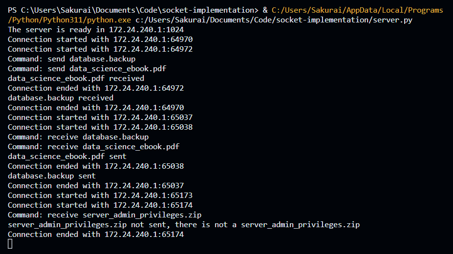
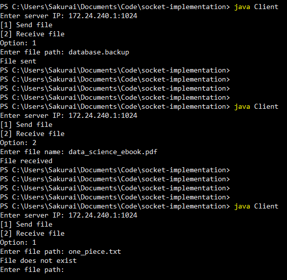
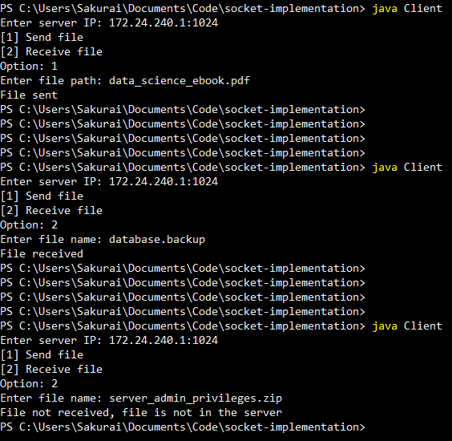

<h1 align="center"> 📂 File Transfer with Sockets 📂 </h1>

This is a project made for my university's Computer Networks class. It implements file transfer between a server made with Python and clients made with Java. Files can be both sent and received from the server. Unfortunately, it only works for hosts within the same network.

### 🖥️ Server

### 🧑 Client 1

### 👩 Client 2

## © Authors

- [Letícia Almeida](https://github.com/Leticia-4lm31d4)
- [Ryan Sakurai](https://github.com/ryansakurai)

*(Computer Science students at UFSCar - Federal University of São Carlos)*